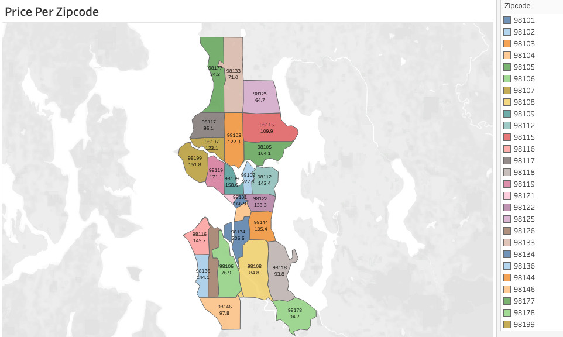
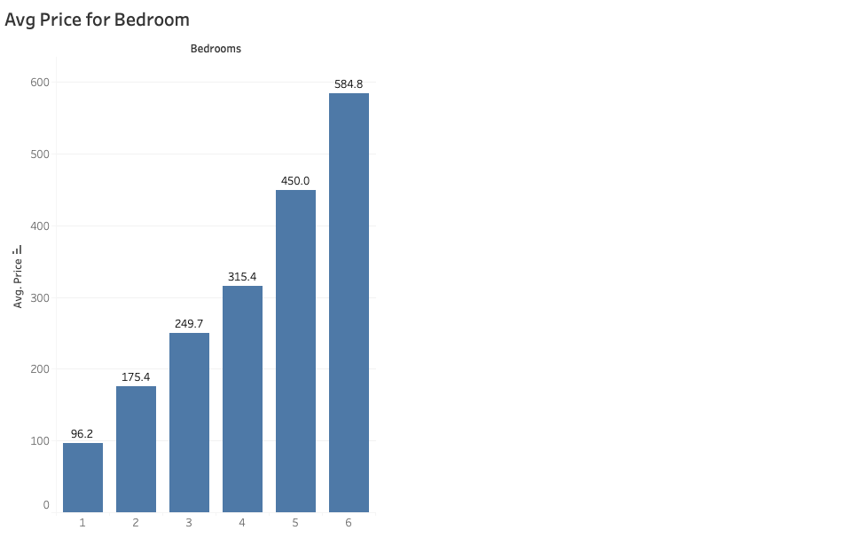
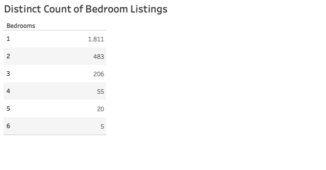
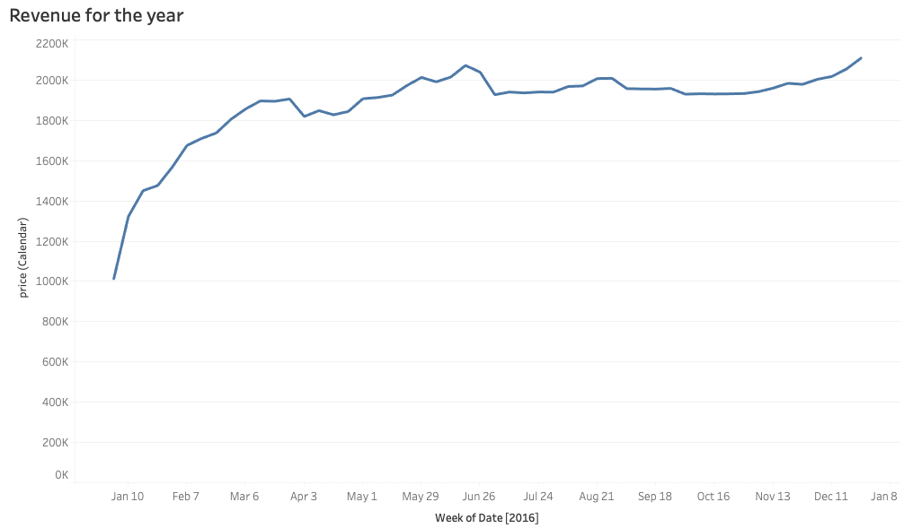

 

Airbnb is a revolutionary platform in the travel and hospitality industry, allowing individuals to rent out their private spaces to guests. It has transformed the way people travel, offering more personal and often more cost-effective accommodations than traditional hotels.
  Airbnb's market varies from single rooms to entire homes, catering to a wide range of travellers, from solo backpackers to large families and groups. The platform operates globally, with listings in urban cities, quiet countryside locations, beachfront properties, and more.
  Hosts on Airbnb set their pricing based on factors like location, amenities, property size, and the number of bedrooms. Prices fluctuate based on demand, seasonality, and local events. Understanding the pricing strategies, particularly how different property characteristics, like the number of bedrooms, affect rental prices, is crucial for hosts to remain competitive and for guests to find the best options for their needs.

This Data Analysis Plots via Tableau showcases key data visualizations derived from an Airbnb dataset, providing insights into the pricing and availability of listings based on bedrooms, geography, and revenue over time.

1. **Avg Price for Bedroom:**
This bar chart illustrates the average price of listings as it correlates with the number of bedrooms. There is a clear positive trend, with prices ranging from around $96 for one-bedroom listings to approximately $585 for six-bedroom listings. As the number of bedrooms increases, the average price rises, with two and three-bedroom listings averaging between $175 and $250, accommodating small to medium-sized groups. A notable price surge occurs at four bedrooms, reaching an average of over $315, and continues to escalate for five and six-bedroom listings, averaging at $450 and $585, respectively. This points to a premium on larger properties, which may reflect a combination of higher demand for spacious accommodations and a lower supply of such listings.
2. **Price Per Zipcode**  is a choropleth map which visualizes the average price of Airbnb listings across different zip codes in a specific region. Each region's color intensity corresponds to its average listing price, providing a geographical context to pricing trends.

  

  **Which areas (shown by zip codes) are the most expensive when it comes to renting/hiring Airbnb accommodations?**

  

  **How does the number of bedrooms in an Airbnb listing affect its average rental price?**
  
  The PLOT1 CHANGE THE NAME plot provides a data-driven insight into how bedroom count—a proxy for property size and potential guest capacity—correlates with rental pricing across Airbnb listings, a vital piece of the puzzle for anyone engaged in the Airbnb marketplace.
  The plot reveals that generally, as the number of bedrooms increases, so does the average price. This trend suggests that larger properties, which can accommodate more guests, command higher prices in the market.

  

 

 

